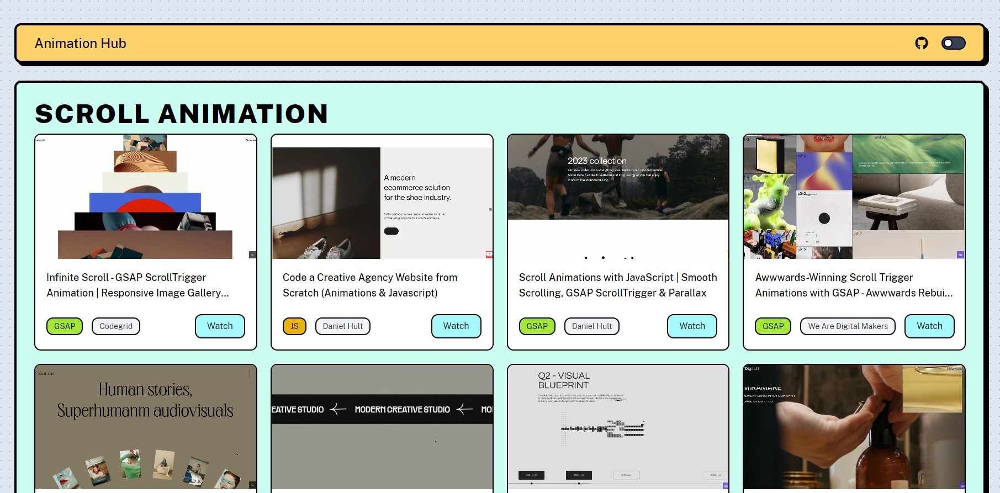

# Web Animation YouTube Tutorial Collection

[Animation Hub](https://animationhub.site/) is a hub of web animation YouTube tutorials. It provides an easy way to browse and preview tutorials with moving previews, making it simpler to find the tutorial you need.

# Table of contents

- [Project Overview](#projectoverview)
- [Technologies](#technologies)
- [License](#license)
- [Acknowledgement](#acknowledgement)

# Project Overview

This is a simple project that uses Sveltia CMS to easily manage and upload MP4 files of the tutorial clips. The clip filename has a shared video link ID, which will later be used to retrieve other information from the Lemnoslife API.

## Helper JavaScript Utilities

### `processTutorials.js`
- Runs before the build process.
- Takes information from the MP4 filename.
- Calls the Lemnoslife API to retrieve additional data about the YouTube tutorial, such as:
  - Tutorial title
  - Link
  - Channel title
- Picks the library badge based on the title keywords.
- Updates the JSON file with the retrieved data.

### `generatePlaceholders.js`
- Runs before the build process.
- Generates gray placeholder images from MP4 files.

These utilities ensure that all necessary data and placeholders are prepared before the build, making the project ready for deployment.

## Performance Best Practices

This project was made with the best practices for performance, including:
- Video placeholders to improve initial load times.
- Using the Intersection Observer API to stop playing videos when they are offscreen.
- Other performance improvements to ensure a smooth user experience.
- 98/100 Lighthouse score for Performance on mobile.

# Technologies

# License

The MIT License

# Acknowledgement

This project design is inspired by [neo-brutalism-ui-library](https://github.com/marieooq/neo-brutalism-ui-library/tree/main).